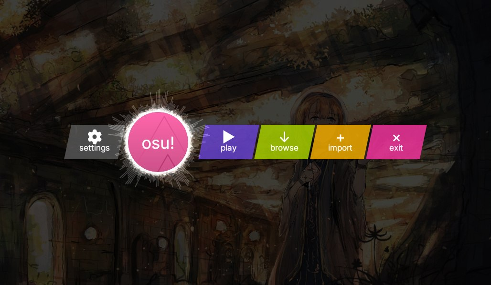
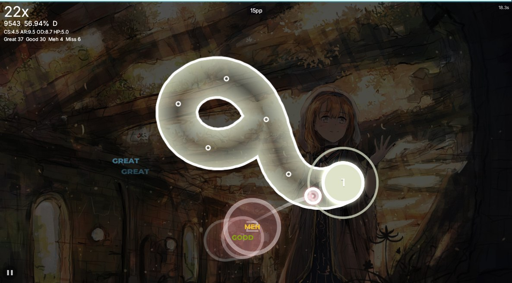
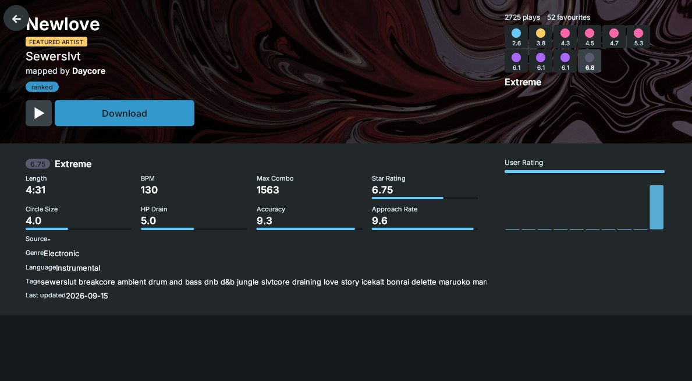
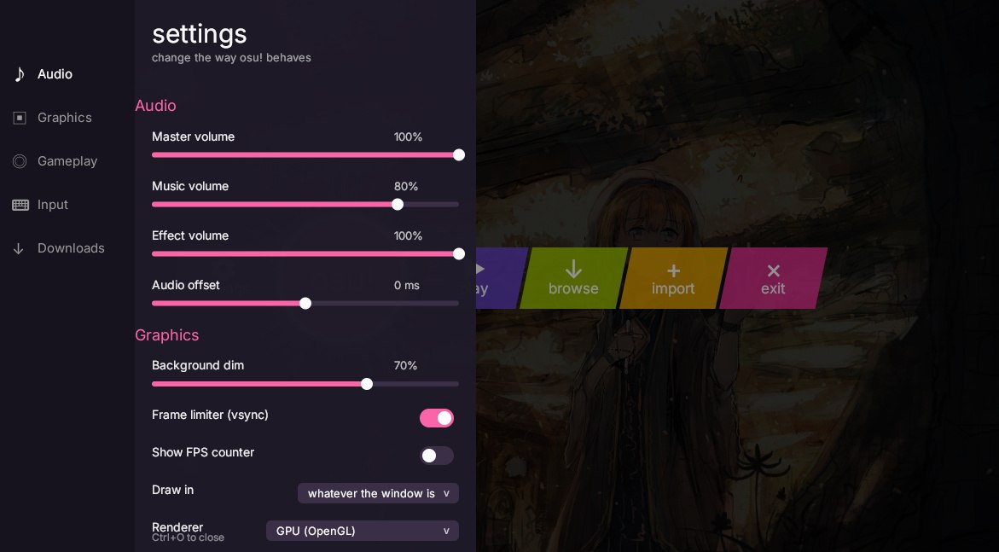
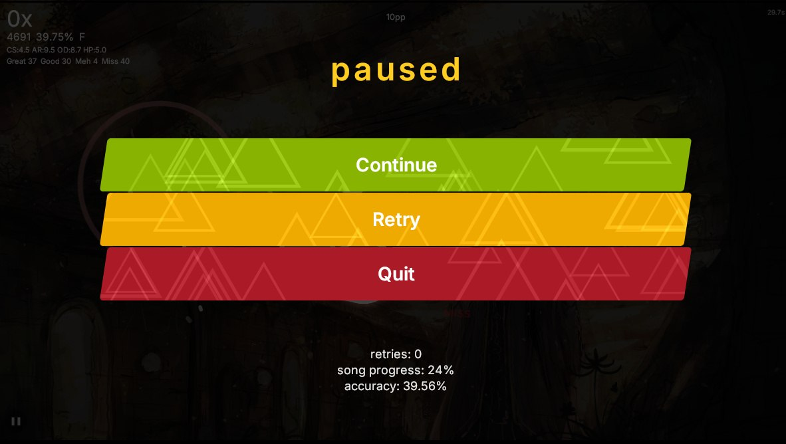

# osu-cpp

An osu! client written in C++23 modules, drawn with Skia. It plays osu!standard
beatmaps, records and replays your plays, and turns a replay into a video.

**Play it in the browser:** <https://j4niwzis.github.io/osu-cpp/>

<p align="center">
  
  
</p>
<p align="center">
  
  
</p>
<p align="center">
  
</p>

## What it does

- **osu!standard only.** A beatmap of any other mode is refused when it is
  loaded.
- **Mods:** the mod selection offers Easy, Half Time, Hard Rock and Double
  Time. Other mods are not implemented.
- **Star rating, and pp shown live while you play.** Two star calculators
  are available: osu!lazer's current one, which is the default, and the one
  the servers run (`--ranked` on the command line).
- **Replays:**
  - every finished play is saved as an `.osr` replay, unless that is turned
    off in the settings; a play cut short by closing the window is saved
    only with `--record`;
  - replays can be browsed and played back in the client, or opened with
    `--replay <path>`;
  - a replay can be exported as an MP4 video. On a native Linux build this
    pipes the rendered frames to an `ffmpeg` binary, which has to be
    installed. The browser, Android and Flatpak builds encode in-process with
    libavcodec instead.
- **Autoplay** (`--autoplay`), including a headless mode that plays a map
  without a window (`--headless`).
- **Beatmaps:** import `.osz` archives (drag one onto the window, or press F1
  to browse), or search and download them from the osu.direct and catboy.best
  mirrors.
- **Skins:** point `--skin` at an osu! skin folder. A pinned set of optional
  artwork can also be downloaded from inside the client.
- **Renderers:** OpenGL, a CPU renderer (Skia raster), and Vulkan through
  Skia's Graphite backend when the client was built with it. Switching to
  Vulkan takes effect after a restart; where the driver refuses Vulkan, the
  client keeps drawing through OpenGL.

## Where it runs

Every one of these is built by CI:

| | |
| --- | --- |
| Linux | native, with dependencies from the system or from pinned sources, and a Vulkan variant |
| Flatpak | `flatpak/io.github.j4niwzis.osu_cpp.yml` |
| Nix | `nix/flake.nix` |
| Guix | `guix/osu-cpp.scm` |
| Browser | WebAssembly, deployed to GitHub Pages from each release |
| Android | APK |
| Ubuntu Touch | click package |

## Building

`.github/workflows/native.yml` is the reference build; what follows is
what it does, reduced to the parts you need.

You need CMake 4.3.4 or newer, Ninja, and a compiler that builds C++23
modules with `import std`. CI uses clang 22 against libstdc++.

libc++ ships the manifest CMake reads to find the `std` module; libstdc++
does not, so CI writes one pointing at the module source that comes with the
headers:

```sh
std=$(ls /usr/include/c++/*/bits/std.cc | sort -V | tail -1)
cat > libstdc++.modules.json <<EOF
{ "version": 1, "revision": 1, "modules": [
  { "logical-name": "std", "source-path": "$std", "is-std-library": true },
  { "logical-name": "std.compat", "source-path": "${std%std.cc}std.compat.cc",
    "is-std-library": true } ] }
EOF
```

```sh
cmake -S standalone -B build -G Ninja -DCMAKE_BUILD_TYPE=Release \
  -DCMAKE_C_COMPILER=clang-22 -DCMAKE_CXX_COMPILER=clang++-22 \
  -DCMAKE_CXX_FLAGS=-stdlib=libstdc++ \
  -DCMAKE_CXX_STDLIB_MODULES_JSON=$PWD/libstdc++.modules.json
cmake --build build
./build/osu_client
```

With libc++, drop the last two options.

Dependencies are resolved by
[cmake-everywhere](https://github.com/j4niwzis/cmake-everywhere), pinned in
`cmake/get_cme.cmake`: whatever the system provides is used, and what it
does not is built from a pinned source. Pass `-DCME_SYSTEM=NEVER` to build
everything from source. Skia is one of the dependencies, so a machine
without it spends a while on the first build.

`-DOSU_VULKAN=ON` adds the Vulkan renderer (Linux only). No distribution
ships a Skia with Graphite in it, so this always builds Skia from source.

### Command line

```
Usage: osu_client [options] <beatmap.osu>
Options:
  --beatmap <path>   Path to the .osu beatmap file
  --skin <path>      Path to an osu! skin folder
  --headless         Run without a window (implies autoplay)
  --autoplay         Let the engine play the beatmap automatically
  --replay <path>    Play a saved .osr replay file
  --record           Record input events and save to .osr after play
  --stars            Print the star rating of the beatmap and exit
  --until <ms>       With --stars, only objects up to this time
  --dump-aim         With --stars, print the per-object aim strain
  --ranked           With --stars, use the calculator the servers run
  --dump-strains     With --stars --ranked, print every section peak
  --trace-replay     Play a replay through the engine and print every judgement
  --legacy-rules     With --trace-replay, use this client's old scoring model
  --dt               Apply DoubleTime
  --ht               Apply HalfTime
  --hr               Apply HardRock
```

## The osu library

The game logic lives apart from the client, as `osucpp`, a static library of
C++ modules. Its only dependency is liblzma. `import osu;` gives you:

- beatmap parsing (`osu::parseBeatmap`);
- the rules and the engine that judges a play;
- star rating (`osu::calculateStars`) and performance points
  (`osu::performanceRanked`);
- reading and writing `.osr` replays (`osu::decodeReplay`,
  `osu::encodeReplay`);
- the autopilot that plays a map by itself.

```cpp
import std;
import osu;

int main() {
  const std::string text = /* the contents of a .osu file */;
  const osu::Beatmap map = osu::parseBeatmap(text);
  const osu::StarRating stars = osu::calculateStars(map);
  std::println("{} objects, {:.2f} stars", map.fObjects.size(), stars.fTotal);
}
```

### Using it

**Through cmake-everywhere.** Say where the library comes from, and it
describes the rest itself:

```cmake
cme_declare_port(NAME osucpp PROVIDES osucpp
  GITHUB_REPOSITORY j4niwzis/osu-cpp GIT_TAG <commit>)
find_package(osucpp REQUIRED)
target_link_libraries(app PRIVATE osucpp::osucpp)
```

If a copy is installed on the machine, and liblzma with it, that copy is
used. Otherwise cmake-everywhere fetches the pinned commit and builds it,
liblzma included.

**Installed.** Configure the repository root and install it:

```sh
cmake -S . -B build-lib -G Ninja -DCMAKE_BUILD_TYPE=Release
cmake --build build-lib
cmake --install build-lib --prefix /usr/local
```

This installs the library, its module sources (a consumer compiles its own
module interfaces from them), a CMake package, and the description
cmake-everywhere reads from a prefix. A plain `find_package(osucpp)` then
works without cmake-everywhere too, as long as CMake can also find liblzma.

## License

AGPL-3.0-only. See `LICENSE`.
